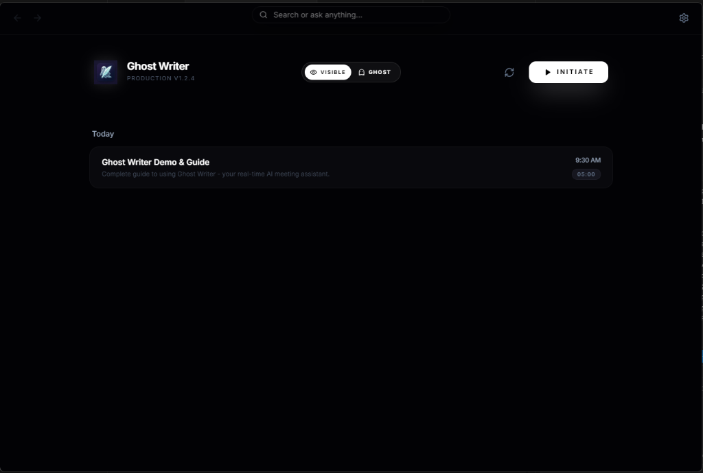
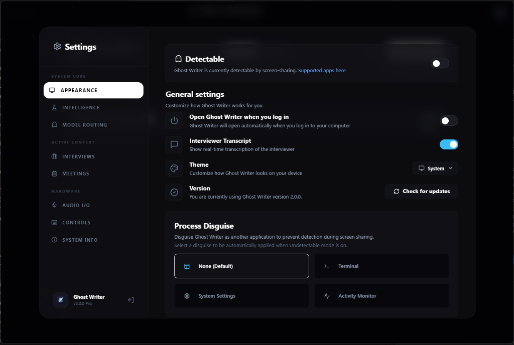
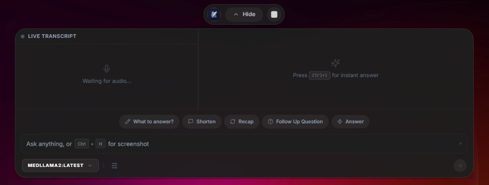
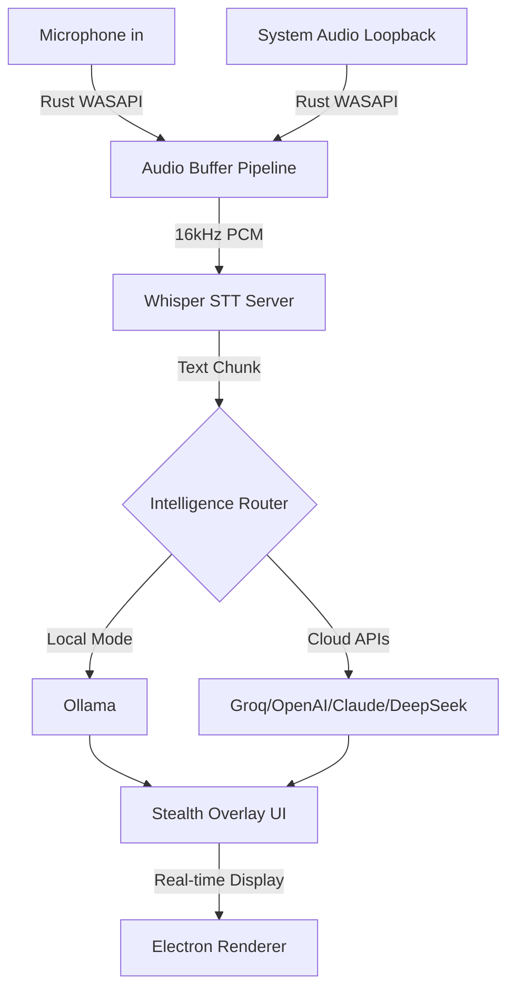

<div align="center">



<br>

[](LICENSE)
[](https://github.com/Sasidhar-7302/Ghost_Writer/releases)
[](https://www.electronjs.org/)
[](https://react.dev/)
[](https://www.rust-lang.org/)
[](https://www.typescriptlang.org/)

**Ghost Writer** is the ultimate stealth, local-first meeting & interview assistant built for professionals. High-stakes interviews and meetings, mastered.  
Bring your own API keys for intelligent Cloud LLMs (OpenAI, DeepSeek, Gemini, Groq) or run 100% air-gapped via Ollama for absolute control over your intelligence data.

[Download](https://github.com/Sasidhar-7302/Ghost_Writer/releases) · [Architecture](ARCHITECTURE.md) · [Support](https://paypal.me/sasidhar7302) · [Changelog](CHANGELOG.md)

</div>

---

## ✨ Feature Highlights

<div align="center">

</div>

<br>

<table>
<tr>
<td width="50%">

### 🎙️ Real-Time Transcription
- **Hybrid Audio Pipeline**: Choose GPU-accelerated local transcription via `whisper.cpp` for ultimate privacy, or lightning-fast cloud STT (Deepgram, Groq, OpenAI) for lower-end hardware.
- **Persistent Server Mode**: Model stays loaded in GPU VRAM for **~1-2s** latency
- **Dual Audio Capture**: Simultaneous microphone + system audio (loopback) via native Rust module
- **Smart Silence Detection**: Skips processing during silence to save GPU cycles

</td>
<td width="50%">

### 🧠 Universal Intelligence Engine
- **Bring Your Own API / Locality**: Seamlessly route intelligence through industry-leading cloud providers (OpenAI, Claude, DeepSeek, Gemini, Groq) or switch to 100% local, air-gapped Ollama models. If you don't want data leaving your hardware, it simply doesn't.
- **Visual Model Feedback**: Real-time "Ready" tickmarks and active model indicators in the UI so you always know which model is answering.
- **Intelligent Meeting Grounding**: Answers are deeply rooted in your provided Resume and the ongoing context of your meeting.
- **Temporal RAG Memory**: The system tracks the rolling window of conversational turns, flawlessly navigating complex follow-up questions without repetition.

</td>
</tr>
<tr>
<td width="50%">

### 👻 Invisible Overlay
- **Screen-Share Safe**: Transparent overlay that's undetectable during screen sharing
- **Always-On-Top**: Persistent floating window with keyboard shortcuts
- **Disguise Mode**: Masquerade as common utility apps (Terminal, etc.)
- **Content Protection**: Prevents screenshots and screen recording of the overlay

<div align="center">
<br>

</div>

</td>
<td width="50%">

### 🏢 Enterprise-Grade
- **Cost Tracking**: Real-time API usage monitoring with breakdowns by provider/model
- **Structured Logging**: Production-grade logging with optional Sentry integration
- **Rate Limiting**: Prevents API overuse with intelligent debouncing
- **Setup Wizard**: Guided first-run onboarding for new users
- **CI/CD**: Automated testing and builds via GitHub Actions

</td>
</tr>
</table>

---

## 🏗️ Architecture



Ghost Writer uses a layered architecture with clear separation of concerns:

| Layer | Technology | Purpose |
|-------|-----------|---------|
| **Frontend** | React 18 + Tailwind CSS + Framer Motion | Transparent overlay UI with animations |
| **IPC Bridge** | Electron IPC (context-isolated) | Secure communication between renderer and main process |
| **LLM Pipeline** | TypeScript | Intent classification, prompt engineering, post-processing |
| **RAG Engine** | all-MiniLM-L6-v2 + SQLite FTS | Local semantic search and conversation memory |
| **Whisper STT** | whisper.cpp server (CUDA) | GPU-accelerated speech-to-text with persistent model loading |
| **Audio Capture** | Rust (N-API) | Native microphone + system audio loopback with DSP pipeline |
| **Database** | SQLite (better-sqlite3) | Meeting history, embeddings, credentials (encrypted) |

> 📖 For detailed architecture documentation, see [ARCHITECTURE.md](ARCHITECTURE.md)

---

## 🚀 Getting Started

Ghost Writer is designed for **one-click deployment**. You don't need to be a developer to use it.

### 1. Download & Install
1. **[Download the Latest Release](https://github.com/Sasidhar-7302/Ghost_Writer/releases)** (`GhostWriter-Setup.exe`).
2. Run the installer.
3. The **Setup Wizard** will launch automatically to guide you through hardware diagnosis and AI configuration.

### 2. Prerequisites (Recommendations)
| Component | Required | Why? | Recommendation |
|-----------|----------|------|----------------|
| **NVIDIA GPU** | Optional* | Fast local transcription | Dedicated GPU with 8GB+ VRAM for high-tier local performance. |
| **Ollama** | Optional | Free local LLM | Download from [ollama.com](https://ollama.com) to run models like `qwen2.5:7b` locally. |
| **API Keys** | Optional | High-accuracy cloud AI | Get a **free** key from [Groq](https://console.groq.com) for ultra-fast, high-quality responses. |

*\*If no GPU is detected, Ghost Writer will automatically fallback to CPU or Cloud if keys are provided.*

---

## 🛠️ Developer Guide

If you want to build Ghost Writer from source:

### Prerequisites
- **Node.js**: 18+
- **Rust**: Latest stable (for N-API native module)
- **NVIDIA GPU**: Required for local Whisper acceleration

### Build Instructions
```bash
# 1. Clone & Install
git clone https://github.com/Sasidhar-7302/Ghost_Writer.git
cd Ghost_Writer
npm install

# 2. Build Native Audio Module
npm run build:native

# 3. Run Development
npm run app:dev

# 4. Pack for Distribution
npm run app:build
```

---

## 🎯 Usage Guide

### During Interviews

| Button | Action | Best For |
|--------|--------|----------|
| **What to Answer** | Analyzes full conversation context and suggests the best response | Immediately after interviewer asks a question |
| **Shorten** | Condenses verbose answers to concise 1-2 sentence summaries | When you need a quick, punchy reply |
| **Recap** | Summarizes the entire conversation with key discussion points | Mid-interview to review what's been covered |
| **Follow Up** | Generates strategic questions to ask the interviewer | End of interview "Do you have questions?" |
| **Answer** | Manual query with full conversation context awareness | Specific questions you want help with |

### Keyboard Shortcuts

| Shortcut | Action |
|----------|--------|
| `Ctrl+K` | Global Spotlight Search — instant AI chat |
| `Ctrl+H` | **Attach Screenshot** — Capture screen and add to chat |
| `Ctrl+Shift+H` | Toggle overlay visibility |
| `Ctrl+Shift+M` | Start/stop meeting |

---

## 🎙️ Speech-to-Text Engine

Ghost Writer uses a **persistent whisper-server** architecture for fast, GPU-accelerated transcription:

```
┌──────────────────────────────────────────────────┐
│                 Audio Pipeline                    │
│                                                   │
│  Microphone ──→ Rust DSP ──→ 16kHz PCM ──┐       │
│                  (NAPI)                   │       │
│                                           ▼       │
│  System Audio ──→ Rust DSP ──→ 16kHz PCM ──→ WAV  │
│   (Loopback)      (NAPI)                  │       │
│                                           ▼       │
│                              ┌─────────────────┐  │
│                              │ whisper-server   │  │
│                              │ (HTTP :8178)     │  │
│                              │                  │  │
│                              │ Model loaded     │  │
│                              │ in GPU VRAM      │  │
│                              │ (~1-2s/chunk)    │  │
│                              └────────┬────────┘  │
│                                       │           │
│                                       ▼           │
│                              Transcript text      │
│                              → LLM Pipeline       │
└──────────────────────────────────────────────────┘
```

### Model Comparison

| Model | Size | Accuracy | Speed (GPU) | Best For |
|-------|------|----------|-------------|----------|
| **Small** | 465 MB | ~85% | ~1.3s/chunk | Fast feedback, casual meetings |
| **Medium** | 1.5 GB | ~92% | ~1.6s/chunk* | High-stakes interviews |

> \* After initial model loading (~15-20s). The whisper-server keeps the model in VRAM, so subsequent chunks are near-instant.

---

## 🛠️ Development

### Commands Reference

| Command | Description |
|---------|-------------|
| `npm run app:dev` | Start full development environment (Vite + Electron) |
| `npm run build:native` | Compile Rust native audio module |
| `npm run build` | Build frontend for production |
| `npm run dist` | Create distributable installer |
| `npm run lint` | Run ESLint checks |
| `npm test` | Run all test suites |

### Project Structure

```
Ghost_Writer/
├── electron/                   # Electron main process
│   ├── audio/                  # Audio capture & transcription
│   │   ├── LocalWhisperSTT.ts  # Whisper server/CLI integration
│   │   ├── WhisperModelManager.ts  # Model download & management
│   │   ├── MicrophoneCapture.ts    # Native mic capture wrapper
│   │   └── SystemAudioCapture.ts   # System audio loopback wrapper
│   ├── llm/                    # LLM processing pipeline
│   │   ├── IntentClassifier.ts # Interview question type detection
│   │   ├── WhatToAnswerLLM.ts  # Core AI response generation
│   │   ├── prompts.ts          # System prompts & persona
│   │   ├── postProcessor.ts    # Response cleanup & formatting
│   │   └── transcriptCleaner.ts    # Transcript normalization
│   ├── rag/                    # Retrieval-Augmented Generation
│   │   ├── RAGManager.ts       # Chunk, embed, and store transcripts
│   │   ├── RAGRetriever.ts     # Semantic search over history
│   │   ├── VectorStore.ts      # SQLite-backed vector storage
│   │   ├── EmbeddingPipeline.ts    # Batch embedding processor
│   │   └── LocalEmbeddingManager.ts # all-MiniLM-L6-v2 pipeline
│   ├── ipc/                    # Modular IPC handlers
│   ├── services/               # Credentials, install management
│   ├── utils/                  # Logging, rate limiting, cost tracking
│   ├── db/                     # SQLite database management
│   ├── main.ts                 # Application entry point
│   └── preload.ts              # Context bridge (security boundary)
├── src/                        # React renderer (frontend)
│   ├── components/
│   │   ├── GhostWriterInterface.tsx  # Main overlay UI
│   │   ├── SettingsOverlay.tsx       # Settings panel
│   │   ├── SetupWizard.tsx           # First-run onboarding
│   │   └── settings/                 # Settings sub-panels
│   └── App.tsx                 # Root component
├── native-module/              # Rust native audio (N-API)
│   └── src/
│       ├── lib.rs              # Module entry point
│       ├── microphone.rs       # Mic capture with WASAPI
│       └── speaker/
│           └── windows.rs      # System audio loopback (WASAPI)
├── .github/workflows/          # CI/CD pipeline
├── assets/                     # Icons, images, docs
└── docs/                       # Additional documentation
```

### Environment Variables

```bash
# API Keys (can also be configured in the UI)
GROQ_API_KEY=your_groq_key
OPENAI_API_KEY=your_openai_key
CLAUDE_API_KEY=your_claude_key
GEMINI_API_KEY=your_gemini_key

# Development
NODE_ENV=development

# Logging
LOG_LEVEL=info
SENTRY_DSN=your_sentry_dsn     # Optional crash reporting
```

---

## 🔌 Supported Providers

### LLM Providers

| Provider | Models | Tier | Latency |
|----------|--------|------|---------|
| **Groq** | Llama 3.3 70B | Free | ⚡ ~0.5s |
| **Google** | Gemini 1.5 Flash/Pro | Free tier available | ⚡ ~1s |
| **Anthropic** | Claude 3.5 Sonnet | Paid | ~2s |
| **OpenAI** | GPT-4o | Paid | ~2s |
| **DeepSeek** | DeepSeek-V3 | Affordable | ~1.5s |
| **Ollama** | qwen2.5, llava (vision) | Free (local) | ⚡ ~1s (GPU) |
| **Custom** | Any OpenAI-compatible API | Varies | Varies |

### Speech-to-Text Providers

| Provider | Type | Latency | Cost |
|----------|------|---------|------|
| **Local Whisper** (default) | GPU-accelerated local | ~1-2s | Free |
| **Groq STT** | Cloud API | ~0.5s | Free tier |
| **OpenAI Whisper** | Cloud API | ~2s | Paid |
| **Deepgram** | Cloud API | ~0.3s | Paid |
| **Azure Speech** | Cloud API | ~1s | Paid |

---

## 🐛 Troubleshooting

<details>
<summary><b>Audio not working</b></summary>

1. Check microphone permissions in Windows Settings → Privacy → Microphone
2. Use the built-in audio test (Settings → Audio → Test Microphone)
3. Ensure your audio device outputs 16-bit PCM at 44.1kHz or 48kHz
</details>

<details>
<summary><b>Whisper transcription is slow</b></summary>

1. Check logs for `✅ whisper-server ready` — if missing, the server failed to start
2. The first transcription after starting a meeting takes ~15-20s (model loading)
3. Subsequent transcriptions should be ~1-2s
4. Switch to the **Small** model in Settings for faster (but less accurate) transcription
5. Ensure you have an NVIDIA GPU with CUDA support
</details>

<details>
<summary><b>API errors or high latency</b></summary>

1. Verify your API keys are valid in Settings
2. Switch to **Groq** (free, fastest) or **Ollama** (local, free) for lower latency
3. Check Settings → Usage Statistics for cost and rate limit information
</details>

<details>
<summary><b>Build errors with native module</b></summary>

1. Ensure Rust toolchain is installed: `rustup show`
2. Run `npm run build:native` separately to see detailed errors
3. On Windows, ensure Visual Studio Build Tools are installed
</details>

---

### 🚀 Hardware-Aware Optimization & Flexible Privacy
- **Scalable Performance**: Automatically detects GPU VRAM (e.g., 8GB+ dedicated GPUs) and optimizes threads (`num_thread: 8`) and context windows (`num_ctx: 32k`) for local models. Users without capable GPUs can seamlessly switch to ultra-fast cloud providers.
- **Instant Pre-loading**: Models are "warmed up" in VRAM background the moment they are selected, reducing cold-start latency to zero.
- **Smart Summarization**: Automatically switches to lightning-fast text models (e.g., qwen2.5:7b) for transcripts, even if a heavy VL model is currently active for vision tasks.
- **Offline Reliability**: Fully functional "Zero-Cloud" mode by leveraging high-accuracy local Ollama + Whisper.

---

- [x] Real-time transcription with GPU acceleration
- [x] Multi-provider LLM support (6+ providers)
- [x] RAG pipeline with local embeddings
- [x] Whisper Server Mode (~1-2s latency)
- [x] Hardware-aware model selection & optimization
- [x] Visual model status & active use indicators
- [x] Professional transcript summarization pipeline
- [ ] macOS support with CoreAudio loopback
- [ ] Multi-language transcription support
- [ ] Shareable meeting notes with polished exports

---

## 🤝 Community & Support

Ghost Writer is developed for the community. If you find it helpful, please consider supporting the project:

- **[Support on PayPal](https://paypal.me/sasidhar7302)**: Support independent development.
- **[Star the Repository](https://github.com/Sasidhar-7302/Ghost_Writer)**: Help more people discover the project.
- **[Contribute](CONTRIBUTING.md)**: Open an issue or submit a pull request.

---
**Quick overview:**
1. Fork the repository
2. Create a feature branch (`git checkout -b feat/amazing-feature`)
3. Commit your changes with [Conventional Commits](https://www.conventionalcommits.com/)
4. Push and open a Pull Request

---

## ⚖️ License

Ghost Writer is open-source software licensed under the **[AGPL-3.0 License](LICENSE)**.  
This ensures that any modifications to the codebase remain open source.

---

## 🙏 Acknowledgments

| Technology | Purpose |
|-----------|---------|
| [Electron](https://www.electronjs.org/) | Cross-platform desktop framework |
| [React](https://react.dev/) | UI component library |
| [Rust](https://www.rust-lang.org/) | High-performance native audio capture |
| [whisper.cpp](https://github.com/ggerganov/whisper.cpp) | Local speech-to-text engine |
| [Tailwind CSS](https://tailwindcss.com/) | Utility-first CSS framework |
| [Framer Motion](https://www.framer.com/motion/) | Animation library |
| [SQLite](https://www.sqlite.org/) | Embedded database |
| [all-MiniLM-L6-v2](https://huggingface.co/sentence-transformers/all-MiniLM-L6-v2) | Local sentence embeddings |

---

<div align="center">

**Built with ❤️ for professionals who want every edge.**

[⬆ Back to Top](#)

</div>
