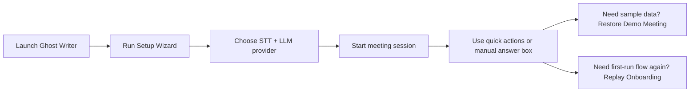
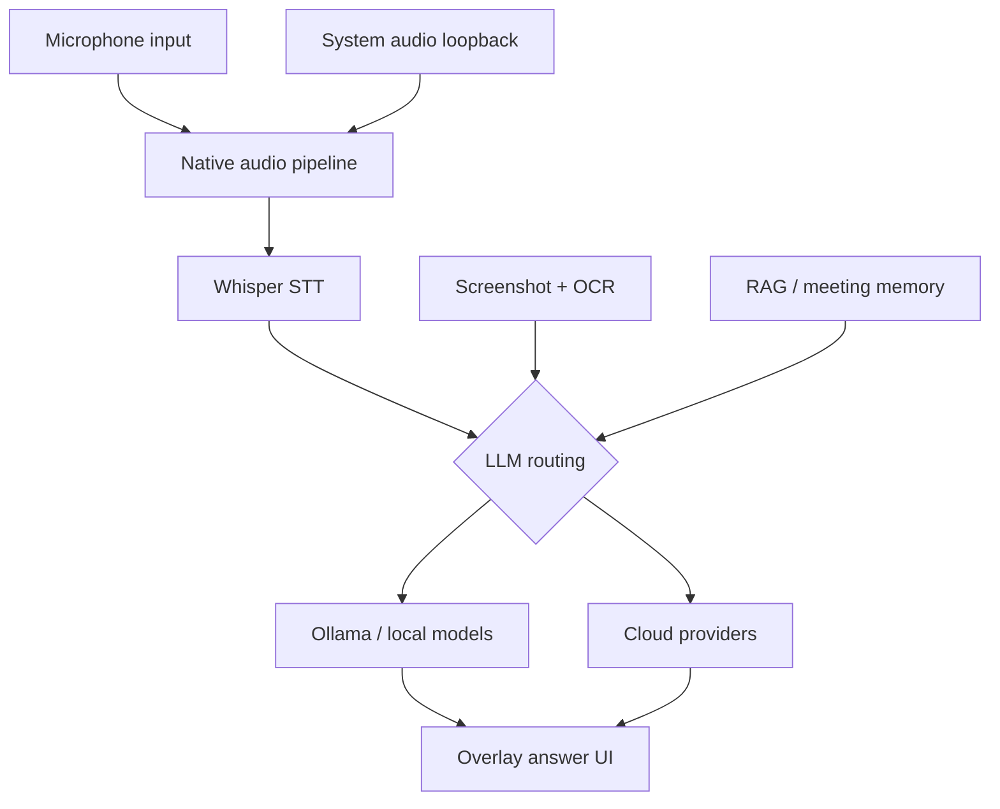

# Ghost Writer

<div align="center">
  

  <br>

  [](docs/LICENSE)
  [](https://github.com/Sasidhar-7302/Ghost_Writer/releases)
  [](https://github.com/Sasidhar-7302/Ghost_Writer/releases)
  [](https://www.electronjs.org/)
  [](https://react.dev/)
  [](https://www.rust-lang.org/)

  Ghost Writer is an open-source desktop copilot for interviews and meetings.
  It combines local or cloud LLMs, local Whisper transcription, screenshot-aware answering, and a stealth-oriented overlay for fast in-session assistance.

  [Download](https://github.com/Sasidhar-7302/Ghost_Writer/releases) · [Architecture](docs/ARCHITECTURE.md) · [Changelog](docs/CHANGELOG.md) · [Contributing](docs/CONTRIBUTING.md)
</div>

---

## Version

Current official release: `v1.0.0`

## Product Snapshot

<div align="center">
  
</div>

<table>
<tr>
<td width="50%">

### Real-time transcription
- Local Whisper with persistent server mode
- Cloud STT options including Deepgram, Groq, OpenAI, Azure, and IBM
- Dual audio capture from microphone and system audio
- Fast chunking and transcript cleanup for live answers

</td>
<td width="50%">

### Flexible intelligence routing
- Local-first with Ollama
- Cloud LLM support for Gemini, OpenAI, Claude, Groq, DeepSeek, and custom OpenAI-compatible providers
- Screenshot-aware prompts and image analysis
- RAG-backed grounding from meeting history and saved context

</td>
</tr>
<tr>
<td width="50%">

### Stealth-oriented overlay
- Overlay-first UI with global shortcuts
- Content-protection and disguise-oriented behavior
- Screenshot attach and quick-answer actions
- Guided onboarding and recovery actions for packaged installs

</td>
<td width="50%">

### Packaged for open-source release
- Windows installer flow
- macOS Apple Silicon `.dmg` flow
- Clean `artifacts/` output for maintainers
- CI aligned to supported Node versions

</td>
</tr>
</table>

<div align="center">
  
</div>

## Core Capabilities

- Real-time transcription from microphone and system audio
- Fast answer generation for live interviews and meetings
- Screenshot attach and image-aware responses
- Local-first operation with Ollama and local Whisper
- Meeting history, summaries, and local RAG grounding
- Guided onboarding, demo meeting seeding, and settings-based recovery actions

## Platforms

- Windows: supported
- macOS: Apple Silicon `arm64` `.dmg` build supported

## Downloads

Official releases are published here:

- [GitHub Releases](https://github.com/Sasidhar-7302/Ghost_Writer/releases)

Stable download asset names:

- Windows: `Ghost.Writer.Setup.exe`
- macOS: `Ghost.Writer.arm64.dmg`

Direct latest-download URLs:

- Windows: `https://github.com/Sasidhar-7302/Ghost_Writer/releases/latest/download/Ghost.Writer.Setup.exe`
- macOS: `https://github.com/Sasidhar-7302/Ghost_Writer/releases/latest/download/Ghost.Writer.arm64.dmg`

## Quick Start

1. Download the latest installer from GitHub Releases.
2. Install and launch Ghost Writer.
3. Complete the Setup Wizard.
4. Pick your model provider.
5. Start a meeting session and use quick actions like `What to Answer`, `Recap`, or `Follow Up`.

The packaged app checks GitHub Releases for updates and surfaces update status in Settings.

## Demo And Onboarding

Ghost Writer includes a built-in demo path for first-time testing.

If the demo meeting is missing:

1. Open `Settings`
2. Go to `Appearance`
3. Use `Restore Demo Meeting`

If you want to replay onboarding:

1. Open `Settings`
2. Go to `Appearance`
3. Use `Replay Onboarding`

If you want to restore the built-in interview or meeting defaults:

1. Open `Settings`
2. Go to the relevant prompt settings section
3. Use `Use Default`

These recovery actions are important for packaged installs because they keep the installed app behavior aligned with development runs.



## Recommended Setup

### Fastest text-first setup

- STT: local Whisper or Deepgram
- LLM: Gemini Flash, Groq, or other low-latency cloud model

### Best local-first setup

- STT: local Whisper
- LLM: Ollama

### Best multimodal interview setup

- Use a vision-capable model for screenshot answering
- Attach screenshots with `Ctrl/Cmd+H`

## Keyboard Shortcuts

- `Ctrl/Cmd+B` or `Alt+G`: toggle visibility
- `Ctrl/Cmd+Shift+Space`: show and center window
- `Ctrl/Cmd+R` or `Alt+C`: reset current state
- `F9`: start or end meeting session
- `F8` or `Ctrl/Cmd+J`: quick "what should I answer"
- `Ctrl/Cmd+Enter`: process current context
- `Ctrl/Cmd+H`: attach screenshot
- `Ctrl/Cmd+Shift+H`: contextual selection capture

## Architecture



Ghost Writer uses a layered desktop architecture with clear separation of concerns:

| Layer | Technology | Purpose |
|-------|-----------|---------|
| Frontend | React 18 + Tailwind CSS + Framer Motion | Overlay UI, settings, onboarding |
| IPC bridge | Electron IPC with context isolation | Secure communication between renderer and main process |
| LLM orchestration | TypeScript helpers and providers | Routing, prompt construction, fallback, post-processing |
| RAG engine | all-MiniLM-L6-v2 + SQLite FTS | Local semantic memory and context retrieval |
| Whisper STT | `whisper.cpp` server | GPU-accelerated or local speech-to-text |
| Audio capture | Rust N-API module | Native microphone + system audio loopback |
| Storage | SQLite + encrypted credentials | Meetings, embeddings, preferences, credentials |

More detail:

- [Architecture](docs/ARCHITECTURE.md)

## Development

### Requirements

- Node.js `20` or `22+`
- npm `10+`
- Rust stable toolchain

The repo includes:

- [.nvmrc](.nvmrc)
- `package.json` engines for the supported Node versions

### Install

```bash
git clone https://github.com/Sasidhar-7302/Ghost_Writer.git
cd Ghost_Writer
npm install
```

### Run in development

```bash
npm run build:native
npm run app:dev
```

### Run checks

```bash
npm run lint
npx tsc -p electron/tsconfig.json --noEmit
npm test
```

### Build production artifacts

```bash
npm run app:build -- --win --x64
```

This produces clean deliverables in `artifacts/`.

## Release Notes For Maintainers

The packaged app can download an external runtime bundle from the GitHub release for the current app version.

Important:

- the release should include `ai-runtime.zip`
- the app looks for that asset at:
  - `https://github.com/Sasidhar-7302/Ghost_Writer/releases/download/v<appVersion>/ai-runtime.zip`

If `ai-runtime.zip` is not uploaded to the release, runtime installation will fail for users who need that bundle.

## Environment Variables

Typical optional variables:

```bash
GEMINI_API_KEY=
OPENAI_API_KEY=
CLAUDE_API_KEY=
GROQ_API_KEY=
DEEPSEEK_API_KEY=
LOG_LEVEL=info
NODE_ENV=development
```

See [.env.example](.env.example) for the full example template.

## Notes About Stealth

Ghost Writer includes stealth-oriented behavior such as content protection, disguise options, and overlay-first usage.
Do not describe it as universally undetectable without validating the exact target app, OS, and screen-sharing mode.

## Current State

`v1.0.0` is the first official release baseline.

It includes:

- packaged Windows and macOS release flow
- cleaned release artifact naming
- corrected packaged app user-data handling
- onboarding replay and demo restoration
- fixed model-selection propagation
- improved screenshot-aware chat flow
- CI aligned with supported Node versions

## License

Ghost Writer is licensed under the [AGPL-3.0 License](docs/LICENSE).

## Contributing

- open an issue for bugs or feature requests
- open a pull request for fixes and improvements
- keep changes aligned with the current Node and Electron toolchain

Useful docs:

- [Architecture](docs/ARCHITECTURE.md)
- [Changelog](docs/CHANGELOG.md)
- [Contributing](docs/CONTRIBUTING.md)
- [Security](docs/SECURITY.md)
